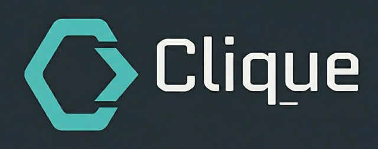

<div align="center"></div>

# Clique

> An exclusive group. A winning leader.

**Clique** is a modular extension for [Click](https://click.palletsprojects.com/) [TBD].

[](https://www.python.org/downloads/)
[](LICENSE)

## Table of Contents
- [Key Features](#key-features)
- [Installation](#installation)
- [Example](#example)
- [License](#license)

## Key Features
[TBD]

## Installation
[TBD]

## Example

```python
import logging
from time import sleep

import click

from clique import CliqueGroup, clone_command, pass_leader, progress_generator

_logger = logging.getLogger(__name__)


def get_package():
    for eta in progress_generator(range(2215), 'implement_package'):
        sleep(eta)
    return 'Clique'


@click.command(name='cmd')
@click.option('-q', '--question', help='Help me help you', required=True)
@pass_leader
def command(leader, question):
    """
    Answer some of your questions about Clique
    """
    with leader.progress_notification('implement_package'):
        get_package()
    leader.send_message(key='task_completed', values={'completion_time': 'now'})

    leader.send_message(f'Check the docs for the answer to your question: "{question}"')


new_command = clone_command(command, 'clone', default_map={'question': 'How do I clone a command?'})


@click.group(cls=CliqueGroup, log_settings={'default_level': logging.DEBUG})
def group():
    _logger.warning('Colorized logs just started...')


group.add_command(command, name='demo', aliases=['ex', 'am', 'ple'])
group.add_command(new_command, help_text='')
```

## License

This project is licensed under the MIT License. See the [LICENSE](LICENSE) file for details.

---
