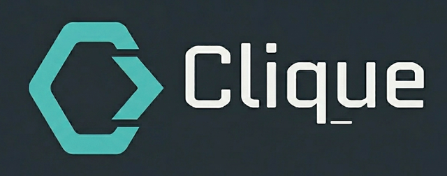

# Clique

> An exclusive group. A winning leader.

**Clique** is a modular extension for [Click](https://click.palletsprojects.com/) [TBD].

## Table of Contents
- [Key Features](#key-features)
- [Installation](#installation)
- [Usage Example](#usage-example)
- [License](#license)

## Key Features
[TBD]

## Installation
[TBD]

## Usage Example
[TBD]

## License

This project is licensed under the MIT License. See the [LICENSE](LICENSE) file for details.

---
